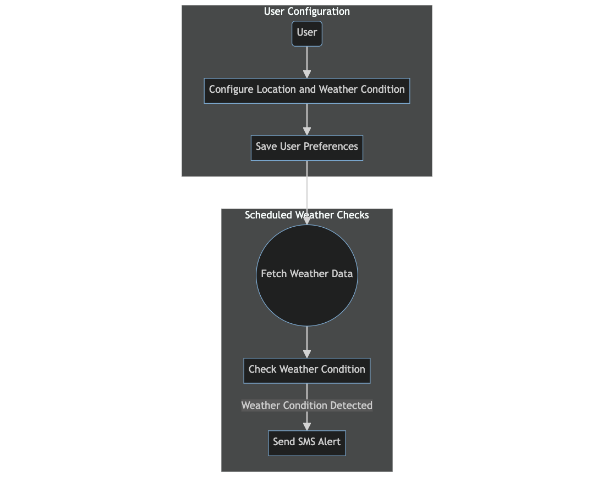

# Realtime Weather Alerting

Reference : [Africa's Talking Summit 2023 presentation ](./resources/Ballerina-AT-Summit.pdf)


## Getting Started

Follow these steps to get started with this demo:

1. Download and install `ballerina` from [https://ballerina.io/downloads/]
2. Clone the repository:

   ```bash
   git clone https://github.com/pcnfernando/weatherAlerts.git
   ```

3. Change to the project directory:

   ```bash
   cd weatherAlerts
   ```

4. Run `bal persist generate` to generate the client objects, types, and SQL scripts. 
   Refer https://ballerina.io/learn/manage-data-persistence-with-bal-persist/

5. Create a `Config.toml` file in the root directory with the following content:

   ```toml
   # Configuration file for "weatherAlerts"
   # How to use see:
   # https://ballerina.io/learn/configure-ballerina-programs/provide-values-to-configurable-variables/#provide-via-toml-syntax

   # Get the key from https://home.openweathermap.org/api_keys
   API_KEY = <WEATHER_API_KEY>	# Type of STRING

   # Refer pre-requisites section in https://lib.ballerina.io/ballerinax/twilio/latest
   TWILIO_ACC_SId = <SID>	# Type of STRING
   TWILIO_AUTH_TOKEN = <TOKEN>	# Type of STRING
   FROM_NUMBER = <NUMBER>	# Type of STRING

   [weatherAlerts.store]
   host = "localhost"
   port = 3307
   user = "dbuser"
   password = "dbuser"
   database = "weatherDb"
   ```

   You can modify the configuration as needed for your application.

6. Run below command to configure the MySQL database
   ```bash
   cd resources && docker compose up
   ```

7. Run the application using the Bal tool:

   ```bash
   bal run
   ```

   This command will use the configuration in `Config.toml` to start your application.

8. This will expose a user alert configurable endpoint in
   ``` 
   http://localhost:9090/weather
   ```

   Example request
   ```
   {
    "location": "Nairobi",
    "condition": "Rain",
    "contactNum": "0000000000"
   }
   ```
